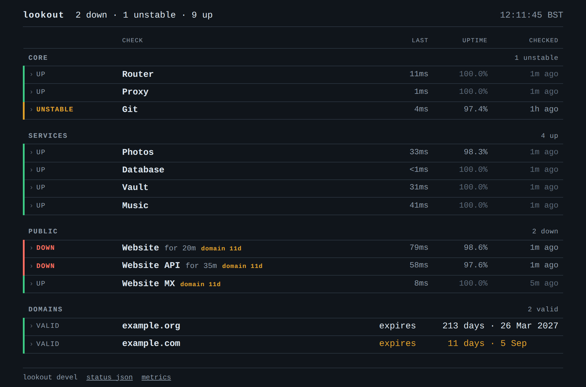
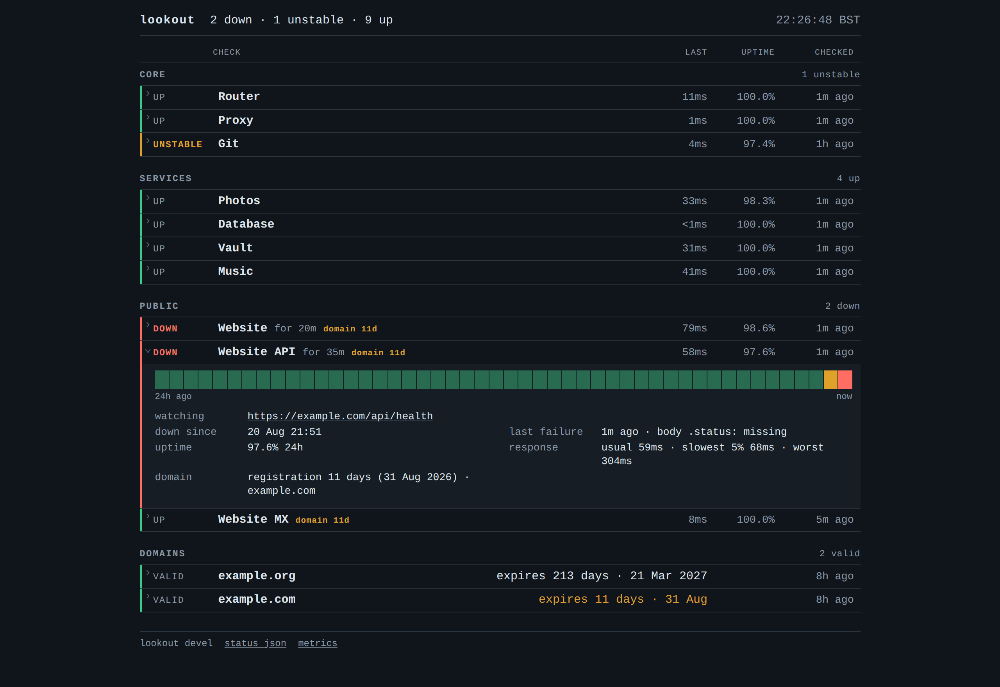

# lookout

A lightweight uptime monitor in Go. One static binary watches your services and
tells you when one breaks. On the machine it runs on here it holds 26 checks in
about 20 MB of memory, on one core it barely wakes.

<picture>
  <source media="(prefers-color-scheme: light)" srcset="docs/board-light.png">
  
</picture>

## Try it

```sh
go run github.com/eeegoloauq/lookout/cmd/lookout@latest demo
```

That serves the board above on `127.0.0.1:5665` filled with invented data.
Nothing is probed and no configuration is read, so you can see what it looks
like before deciding whether you want it.

## Run it

```sh
CGO_ENABLED=0 go build -o lookout ./cmd/lookout
cp config.example.yaml config.yaml    # edit it
./lookout validate config.yaml
./lookout run config.yaml
```

Or as a container:

```sh
docker run -d --name lookout \
  -p 5665:5665 \
  -v $PWD/config.yaml:/etc/lookout/config.yaml:ro \
  -v lookout-state:/var/lib/lookout \
  -e LOOKOUT_TELEGRAM_TOKEN -e LOOKOUT_TELEGRAM_CHAT_ID \
  ghcr.io/eeegoloauq/lookout:latest
```

Configuration is one YAML file, and `config.example.yaml` is its reference:
every option is in it with a comment saying what it is for. `validate` reports
every problem at once with the line each one is on, and `run` refuses to start
on a config that does not pass — a monitor that dies at 2am because of a typo
is a monitor that was not watching.

## What it checks

**http** — status code, response time, a substring of the body, or a JSON path
compared against a value. If a body path stops resolving, the check reports
`malformed` rather than `down`, because an API that changed shape is not an
outage and should not read like one.

**tcp** — dials a `host:port` and hangs up without sending anything. This is
the check for a database, a broker, an SSH daemon, or a container that exposes
nothing but a port.

**dns** — A, AAAA, MX, NS or TXT against a resolver you name. A lost UDP packet
is retried rather than counted; a changed answer set is drift, and the first
answer is a baseline rather than an alert. Drift is read off answers only — a
resolver that returns SERVFAIL fails the check instead, because "I could not
look it up" is not "the records moved".

**TLS and domain expiry** come along for free. Certificate dates are read out of
the handshake an `https` check already performs. Registration dates are worked
out from the names your checks already point at — no second block of config —
and looked up once a day over RDAP, or WHOIS where there is no RDAP.

## When something breaks

A check goes down after a few consecutive failures and comes back after a few
consecutive successes; both counts are yours to set. There is a second detector
for the service that alternates rather than fails, since a consecutive counter
never notices that one.

The message goes to Telegram. Everything that changed within a short window
leaves as one message rather than fifteen, an outage that stays open repeats on
a schedule you choose, and once a week lookout says it is still alive so that
silence stays meaningful. Every event is written to a durable queue before
anything tries to send it, and leaves that queue only once Telegram confirms it
arrived.

Quiet hours are a schedule in the config, or `lookout mute --for 2h --group
Public` when you are about to break something on purpose. Probes keep running
either way; only delivery stops, and what happened while you were away arrives
as one summary when the mute lifts.

## The page

<picture>
  <source media="(prefers-color-scheme: light)" srcset="docs/detail-light.png">
  
</picture>

Every row opens into what the check watches, when it broke, what it said, uptime
over three windows, how the response time is spread, and a bar of the last
24 hours. It is server-rendered HTML with no framework, no external font, no
icon set and nothing loaded from a CDN, which is the point: a status page that
goes blank when the network does is not a status page.

Alongside it, `/api/status` is versioned JSON, `/metrics` is Prometheus text,
and `/healthz` returns 503 when alerts are piling up undelivered — a monitor
that cannot tell you anything should look broken from the outside.

## Deploying

`contrib/systemd/lookout.service` runs it as its own user with
`ProtectSystem=strict` and an empty capability set. Secrets come from an
environment file, never from the config:

```sh
install -o root -g root -m 0755 lookout /usr/bin/lookout
useradd --system --home /var/lib/lookout --shell /usr/sbin/nologin lookout
install -d -o lookout -g lookout -m 0750 /var/lib/lookout
install -d -o root   -g lookout -m 0750 /etc/lookout
install -o root -g lookout -m 0640 config.yaml /etc/lookout/config.yaml
install -o root -g lookout -m 0600 contrib/lookout.env.example /etc/lookout/lookout.env
install -o root -g root -m 0644 contrib/systemd/lookout.service /etc/systemd/system/
# put the bot token and chat id in /etc/lookout/lookout.env, then
systemctl enable --now lookout
```

Point `state.file` and its neighbours at `/var/lib/lookout/`, or
`ProtectSystem=strict` will not let lookout write them.

### Staying current

`contrib/lookout-update` moves an installed lookout to the latest release. It
fetches the published binary and `SHA256SUMS`, refuses to install on a checksum
mismatch, refuses to install a binary that will not load the running config,
and — if the restarted service does not answer `/healthz` — puts the previous
binary back and restarts again. The three most recent binaries it replaced stay
in `/var/backups/lookout`.

```sh
install -o root -g root -m 0755 contrib/lookout-update /usr/local/bin/
lookout-update            # or --dry-run to see what it would do
```

`REPO`, `BIN`, `CONFIG`, `SERVICE`, `HEALTH_URL`, `BACKUP_DIR` and `RELEASES`
are read from the environment, so a fork or a second instance needs no edit.
For unattended updates, install `contrib/systemd/lookout-update.{service,timer}`
and `systemctl enable --now lookout-update.timer`; it runs daily with a couple
of hours of jitter.

## Limits worth knowing

Every probe leaves from the machine lookout runs on. If that machine is the one
that is down, nobody is watching — an external monitor is a different job and
lookout does not pretend to do it.

Notifications go to Telegram and nowhere else. There is no web UI for adding a
check; the config is in git, and a check that exists only inside a running
process is one nobody can review or restore.

The status page renders without JavaScript, which means a row opens through a
checkbox and `:has()`. A browser without `:has()` shows the whole board and
never opens a row: the detail is out of reach, nothing else is.

## Contributing

`docs/design.md` explains why the parts that look strange are the way they are —
no database, no keep-alives, no third status. Read it before proposing a change
to one of them.

```sh
go vet ./... && go test -race ./...
```

MIT.
