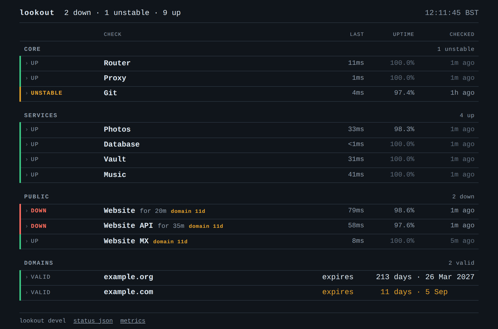
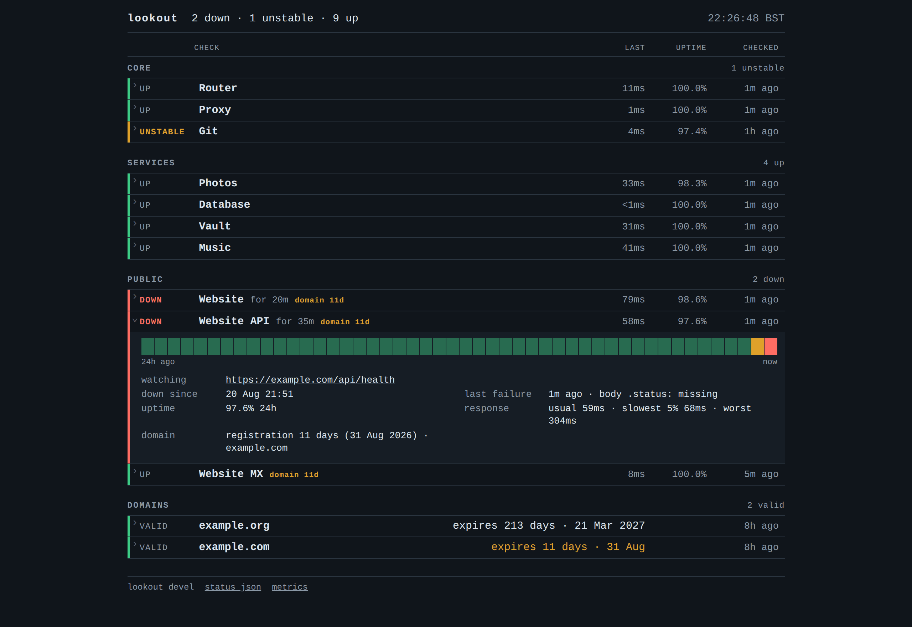

# lookout

An uptime monitor in Go: HTTP, TCP, DNS and push checks, a status page and Telegram alerts. One
binary and one YAML file.

[](https://github.com/eeegoloauq/lookout/releases/latest)
[](https://github.com/eeegoloauq/lookout/actions/workflows/ci.yml)
[](LICENSE)

<picture>
  <source media="(prefers-color-scheme: light)" srcset="docs/board-light.png">
  
</picture>

## Try it

```sh
go run github.com/eeegoloauq/lookout/cmd/lookout@latest demo
```

This serves the board above with made-up data. Nothing is probed and no config is read.

## Run it

```sh
CGO_ENABLED=0 go build -o lookout ./cmd/lookout
cp config.example.yaml config.yaml
```

Edit `config.yaml` before the first run:

- Replace the example checks with yours.
- Point `state.file`, `state.history` and `state.samples` at a directory you can write to. The
  example uses `/var/lib/lookout/`.
- Alerts need `LOOKOUT_TELEGRAM_TOKEN` and `LOOKOUT_TELEGRAM_CHAT_ID` in the environment. To run
  without alerts, set `alerting.mode: none`.
- The example also reads `LOOKOUT_BASIC_AUTH` and `LOOKOUT_PUSH_TOKEN_ZFS`. Set them or delete the
  checks that use them.

```sh
./lookout validate config.yaml   # lists every problem with its line number
./lookout run config.yaml
```

`run` refuses a config that does not validate. The page listens on `127.0.0.1:5665` by default
(`listen:`).

As a container:

```sh
docker run -d --name lookout \
  -p 5665:5665 \
  -v $PWD/config.yaml:/etc/lookout/config.yaml:ro \
  -v lookout-state:/var/lib/lookout \
  -e LOOKOUT_TELEGRAM_TOKEN -e LOOKOUT_TELEGRAM_CHAT_ID \
  ghcr.io/eeegoloauq/lookout:latest
```

Set `listen: 0.0.0.0:5665` in the config for the port mapping to reach it.

`config.example.yaml` is the configuration reference: every option is there with a comment.

## Checks

- **http**: status code, response time, a substring of the body, or a JSON path compared with a
  value. A JSON path that no longer resolves reports `malformed` instead of `down`.
- **tcp**: connects to `host:port` and closes the connection without sending anything. For
  databases, brokers, SSH and other services that only expose a port.
- **dns**: A, AAAA, MX, NS or TXT against a resolver you choose. A lost UDP packet is retried. An
  answer that differs from the first one seen is reported as drift; SERVFAIL fails the check.
- **push**: a dead-man switch for jobs such as backups and renewals. The job calls lookout when it
  finishes, and the check goes down when a call does not arrive in time.
- **domain**: registration expiry over RDAP, or WHOIS where the TLD has no RDAP, checked once a
  day. A domain check is added automatically for every host your http and dns checks use; declare
  one yourself to set its interval or group.
- TLS certificate expiry is read from the handshake of an `https` http check. There is no separate
  check type for it.

A push check:

```yaml
  - name: ZFS tank
    group: Jobs
    type: push
    expect_every: 10m                   # deadline between pings
    grace: 2m                           # optional, default 0
    token: ${LOOKOUT_PUSH_TOKEN_ZFS}    # secret part of the ping URL
```

```sh
# crontab: ping after the job succeeds
0 3 * * * /usr/local/bin/backup.sh && curl -fsS "$LOOKOUT_PUSH_URL"
# or report the failure
0 3 * * * /usr/local/bin/backup.sh || curl -fsS "$LOOKOUT_PUSH_URL?status=fail&msg=backup+failed"
```

The URL is `http://<listen>/api/push/<token>`, GET or POST, and answers 204. An unknown token gets
a plain 404. `msg` is cut to 200 characters and shown on the page. The deadline is checked once a
minute and a missed ping goes through the same `failure_threshold` as other checks, so the check
turns DOWN a few minutes after the deadline. Unlike `mute`, this endpoint is not limited to
loopback, so `listen:` must be reachable from the machine running the job.

## Alerts

A check goes down after a set number of consecutive failures and comes back after a set number of
consecutive successes. A second detector catches a service that keeps flapping between the two.

Alerts go to Telegram:

- Changes within a short window are sent as one message.
- An outage that stays open is repeated on the schedule you set.
- Once a week lookout sends a message that it is still running.
- Every event is written to a durable queue first and removed only after Telegram confirms
  delivery.

Quiet hours are set with `mute:` in the config, or ad hoc with
`lookout mute --for 2h --group Public`. Checks keep running while muted. What happened during the
mute is sent as one summary when it ends.

## Status page and API

<picture>
  <source media="(prefers-color-scheme: light)" srcset="docs/detail-light.png">
  
</picture>

Each row opens to show what the check watches, when it failed and with what error, uptime over
three windows, the response time distribution, the last 30 days and the last 24 hours. The page is
server-rendered HTML with no framework and no CDN assets.

- `/api/status`: versioned JSON.
- `/metrics`: Prometheus text format.
- `/healthz`: 503 when alerts are queued and not delivered.

## Deploy with systemd

`contrib/systemd/lookout.service` runs lookout as its own user with `ProtectSystem=strict` and no
capabilities. Secrets go in an environment file, not in the config:

```sh
install -o root -g root -m 0755 lookout /usr/bin/lookout
useradd --system --home /var/lib/lookout --shell /usr/sbin/nologin lookout
install -d -o lookout -g lookout -m 0750 /var/lib/lookout
install -d -o root   -g lookout -m 0750 /etc/lookout
install -o root -g lookout -m 0640 config.yaml /etc/lookout/config.yaml
install -o root -g lookout -m 0600 contrib/lookout.env.example /etc/lookout/lookout.env
install -o root -g root -m 0644 contrib/systemd/lookout.service /etc/systemd/system/
# add the bot token and chat id to /etc/lookout/lookout.env, then
systemctl enable --now lookout
```

The state files must be under `/var/lib/lookout/`; `ProtectSystem=strict` blocks writes elsewhere.

### Updates

`contrib/lookout-update` installs the latest release. It downloads the binary and `SHA256SUMS`,
stops on a checksum mismatch or if the new binary cannot load the running config, and restores the
previous binary if the restarted service fails `/healthz`. The last three replaced binaries are
kept in `/var/backups/lookout`.

```sh
install -o root -g root -m 0755 contrib/lookout-update /usr/local/bin/
lookout-update            # --dry-run shows what it would do
```

`REPO`, `BIN`, `CONFIG`, `SERVICE`, `HEALTH_URL`, `BACKUP_DIR` and `RELEASES` can be overridden
from the environment. For daily unattended updates, install
`contrib/systemd/lookout-update.{service,timer}` and run
`systemctl enable --now lookout-update.timer`.

## Limits

- All probes run from the lookout host, so it cannot report its own host going down. Use an
  external monitor for that.
- Alerts go to Telegram only.
- Checks are added in the config, not on the page.
- The page reloads itself with an inline script, or with a meta refresh when JavaScript is off.
  Rows open through a checkbox and `:has()`; browsers without `:has()` show the board but cannot
  open rows.

## Development

```sh
go vet ./... && go test -race ./...
```

`docs/design.md` explains the less obvious decisions: no database, no keep-alives, two statuses
instead of three.

## License

MIT
